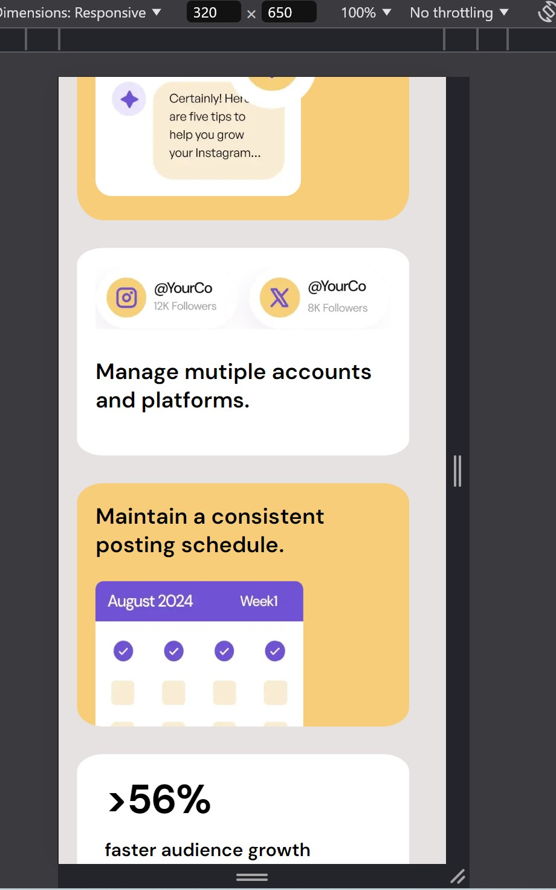

# Frontend Mentor - Bento Grid Solution

This is a solution to the Bento grid challenge on Frontend Mentor. Frontend Mentor challenges help you improve your coding skills by building realistic projects.

## Table of contents

- [Overview](#overview)
  - [Screenshot](#screenshot)
  - [Links](#links)
- [My process](#my-process)
  - [Built with](#built-with)
- [Author](#author)

## Overview

- View the optimal layout for the interface depending on their device's screen size
- See hover and focus states for all interactive elements on the page

### Screenshot

### Links

- Solution URL: [Github url](https://github.com/NC-Aravindh/BentoGrid)
- Live Site URL: [Live Demo](https://nc-aravindh.github.io/BentoGrid/)

## My process

### Built with

- Semantic HTML5 markup
- CSS custom properties
- Flexbox
- Grid

## Author

- Website - [Aravindh.NC](https://www.your-site.com)
- Frontend Mentor - [@NC-Aravindh](https://www.frontendmentor.io/profile/NC-Aravindh)
